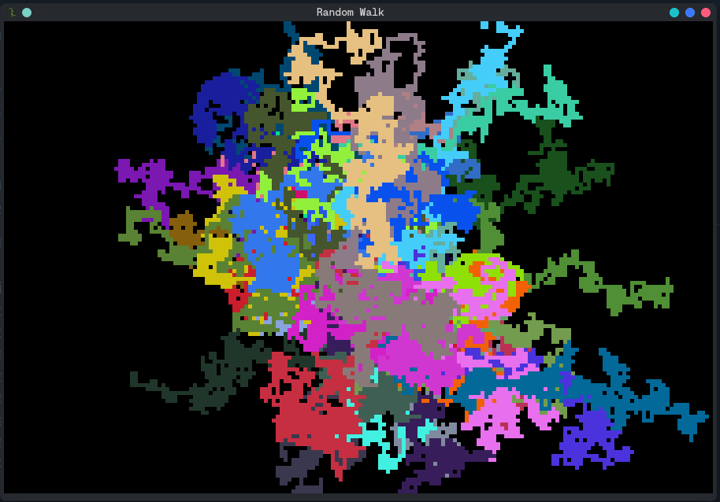
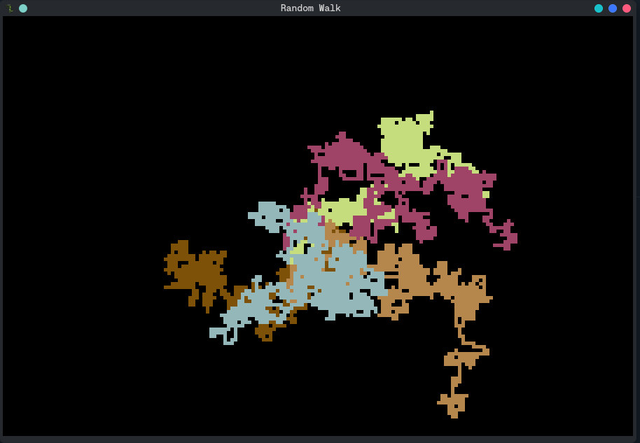

## Random Walk 

Simulação visual de Random Walk usando C++ e Allegro5.

Múltiplos agentes começam no centro da tela e se movem aleatoriamente em 4 direções, deixando um rastro colorido de suas trajetórias. Cada agente tem uma cor RGB aleatória.

## Como Compilar:

g++ -std=c++17 main.cpp random_walk.cpp -o random_walk -lallegro -lallegro_primitives

Ou usando o script:

chmod +x run.sh
./run.sh

## Como Executar:
./random_walk

Digite a quantidade de agentes e pronto.

## Características:
- 120 FPS de renderização suave
- Cores aleatórias para cada agente
- Janela redimensionável
- Fechamento instantâneo

## Resultado

